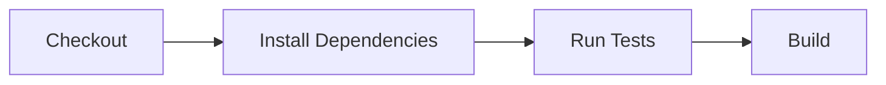
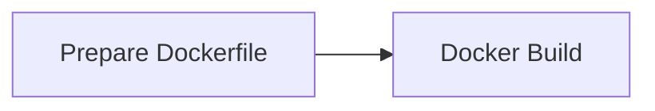
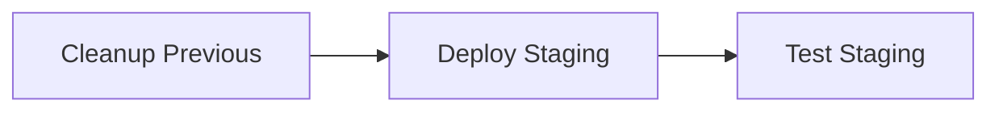
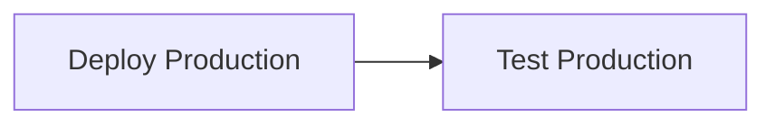

# Projet Jenkins - CI/CD avec Docker

Ce projet démontre une **pipeline CI/CD complète** utilisant Jenkins pour déployer une application JavaScript dans des conteneurs Docker. Il implémente une stratégie de déploiement **blue-green** avec validation automatique.

##  Architecture du Projet

### Vue d'ensemble
```
┌─────────────────┐    ┌──────────────────┐    ┌─────────────────┐
│   Jenkins       │    │   Docker Host    │    │   Application   │
│   (Container)   │───▶│   (Host)         │───▶│   (Containers)   │
│                 │    │                  │    │                 │
│ • Pipeline      │    │ • Docker Daemon  │    │ • Staging:3001  │
│ • Tests         │    │ • Images         │    │ • Production:3000│
│ • Build         │    │ • Containers     │    │ • Health Checks │
└─────────────────┘    └──────────────────┘    └─────────────────┘
```

### Structure du projet
```
JENKINS/
├── Jenkinsfile              # Pipeline Jenkins (10 étapes)
├── Dockerfile               # Configuration Docker
├── package.json             # Dépendances du projet principal
├── test-app.sh              # Script de test manuel
├── jest.config.js           # Configuration Jest
├── mon-app-js/              # Application JavaScript
│   ├── package.json         # Dépendances de l'application
│   ├── server.js            # Serveur Express
│   ├── src/                 # Code source
│   │   ├── index.html       # Interface utilisateur
│   │   ├── app.js           # Logique métier
│   │   ├── styles.css       # Styles CSS
│   │   └── utils.js         # Utilitaires
│   └── tests/               # Tests unitaires
│       └── app.test.js      # Tests Jest
└── node_modules/            # Dépendances installées
```

## �� Pipeline Jenkins - Fonctionnement Détaillé

### Phase 1 : Préparation (Étapes 1-4)


1. **Checkout** : Récupération du code source depuis le repository Git
2. **Install Dependencies** : Installation des dépendances npm avec `npm ci`
3. **Run Tests** : Exécution des tests unitaires Jest avec génération de rapports JUnit
4. **Build** : Construction de l'application (copie des fichiers dans `dist/`)

### Phase 2 : Containerisation (Étapes 5-6)


5. **Prepare Dockerfile** : Vérification de la configuration Docker
6. **Docker Build** : Construction de l'image Docker `mon-app-js-image`

### Phase 3 : Déploiement Staging (Étapes 7-8)


7. **Cleanup Previous Deployments** : Nettoyage des anciens conteneurs
8. **Deploy Staging** : Déploiement sur le port 3001 avec `NODE_ENV=staging`
9. **Test Staging** : Validation complète de l'environnement staging

### Phase 4 : Déploiement Production (Étapes 9-10)


10. **Deploy Production** : Déploiement sur le port 3000 avec `NODE_ENV=production`
11. **Test Production** : Validation complète de l'environnement production

## Configuration Docker

### Dockerfile
```dockerfile
FROM node:22-alpine                    # Image de base légère
WORKDIR /app                          # Répertoire de travail
COPY mon-app-js/package*.json ./      # Copie des dépendances
RUN npm install --omit=dev            # Installation production uniquement
COPY mon-app-js/server.js ./          # Copie du serveur
COPY mon-app-js/src/ ./src/           # Copie du code source
EXPOSE 3000                           # Port exposé
CMD ["node", "server.js"]             # Commande de démarrage
```

### Communication Docker
- **Jenkins → Docker Host** : `DOCKER_HOST=tcp://host.docker.internal:2375`
- **Tests → Application** : `http://host.docker.internal:PORT`
- **Utilisateur → Application** : `http://localhost:PORT`

## Tests et Validation

### Tests Automatiques
1. **Tests Unitaires** : Jest avec rapports JUnit
2. **Tests d'Intégration** : Validation des endpoints `/` et `/health`
3. **Tests de Charge** : 5 requêtes consécutives pour valider la stabilité
4. **Tests de Santé** : Vérification de la disponibilité des services

### Endpoints de l'Application
- **Page d'accueil** : `GET /` → Interface utilisateur
- **Health Check** : `GET /health` → Statut de l'application
  ```json
  {
    "status": "OK",
    "timestamp": "2024-01-15T10:30:00.000Z",
    "version": "1.0.0",
    "environment": "production",
    "port": 3000
  }
  ```

## Démarrage du Projet

### Prérequis
- Docker installé et en cours d'exécution
- Jenkins configuré avec Docker
- Node.js 18+ (pour le développement local)
- Git (pour le versioning)

### 1. Configuration Jenkins
```bash
# Vérifier que Docker est accessible depuis Jenkins
docker --version
docker ps

# Configurer le DOCKER_HOST si nécessaire
export DOCKER_HOST=tcp://host.docker.internal:2375
```

### 2. Démarrage Manuel (Développement)
```bash
# Installation des dépendances
npm ci

# Démarrage de l'application en mode développement
cd mon-app-js
npm start
```

### 3. Build et Déploiement Docker Manuel
```bash
# Construction de l'image
docker build -t mon-app-js-image .

# Déploiement staging
docker run -d --name mon-app-js-staging -p 3001:3000 -e NODE_ENV=staging mon-app-js-image

# Déploiement production
docker run -d --name mon-app-js-production -p 3000:3000 -e NODE_ENV=production mon-app-js-image
```

### 4. Tests Manuels
```bash
# Test des deux environnements
./test-app.sh 3001 3000

# Test individuel
curl http://localhost:3001/health  # Staging
curl http://localhost:3000/health  # Production
```

## Environnements

### Staging (Pré-production)
- **URL** : `http://localhost:3001`
- **Health** : `http://localhost:3001/health`
- **Environnement** : `NODE_ENV=staging`
- **Usage** : Tests et validation avant production

### Production
- **URL** : `http://localhost:3000`
- **Health** : `http://localhost:3000/health`
- **Environnement** : `NODE_ENV=production`
- **Usage** : Application finale pour les utilisateurs

## Commandes Utiles

### Gestion des Conteneurs
```bash
# Voir les conteneurs en cours
docker ps

# Voir les logs d'un conteneur
docker logs mon-app-js-staging
docker logs mon-app-js-production

# Arrêter les conteneurs
docker stop mon-app-js-staging mon-app-js-production

# Supprimer les conteneurs
docker rm mon-app-js-staging mon-app-js-production

# Nettoyer les images
docker rmi mon-app-js-image
```

### Tests et Debugging
```bash
# Tests unitaires
npm test

# Tests avec couverture
npm run test -- --coverage

# Build de l'application
npm run build

# Nettoyage
npm run clean
```

## Monitoring et Logs

### Logs Jenkins
- **Pipeline** : Logs détaillés de chaque étape
- **Tests** : Rapports JUnit et Jest
- **Docker** : Logs de construction et déploiement

### Logs Application
- **Démarrage** : Confirmation du port et environnement
- **Requêtes** : Logs des accès aux endpoints
- **Erreurs** : Gestion des erreurs et stack traces

##  Dépannage

### Problèmes Courants
1. **Docker non accessible** : Vérifier `DOCKER_HOST`
2. **Ports occupés** : Changer les ports ou arrêter les conteneurs
3. **Tests échoués** : Vérifier les logs des conteneurs
4. **Build échoué** : Vérifier les dépendances et le Dockerfile

### Commandes de Debug
```bash
# Vérifier les conteneurs
docker ps -a

# Vérifier les images
docker images

# Vérifier les ports
netstat -tulpn | grep :300

# Tester la connectivité
curl -v http://localhost:3001/health
```

## Points Clés du Projet

- ✅ **CI/CD Complète** : Pipeline Jenkins automatisé
- ✅ **Containerisation** : Docker pour la portabilité
- ✅ **Blue-Green Deployment** : Déploiement sans interruption
- ✅ **Tests Automatisés** : Validation à chaque étape
- ✅ **Monitoring** : Health checks et logs
- ✅ **Environnements Multiples** : Staging et Production
- ✅ **Nettoyage Automatique** : Gestion des ressources

Ce projet démontre une maîtrise complète des technologies DevOps modernes et des bonnes pratiques de déploiement continu.

## Documentation avec Images

Une documentation complète avec captures d'écran est disponible dans le fichier `DOCUMENTATION_AVEC_IMAGES.md`.

### Images Disponibles
- `image/README/Capture d'écran 2025-09-19 162236.png` - Vérification des prérequis
- `image/README/Capture d'écran 2025-09-19 162523.png` - Installation des dépendances
- `image/README/Capture d'écran 2025-09-19 162624.png` - Tests unitaires
- `image/README/Capture d'écran 2025-09-19 163506.png` - Build de l'application
- `image/README/Capture d'écran 2025-09-19 163541.png` - Construction Docker
- `image/README/Capture d'écran 2025-09-19 163555.png` - Déploiement des conteneurs

### Documentation Complète
Consultez `DOCUMENTATION_AVEC_IMAGES.md` pour une documentation détaillée avec captures d'écran de chaque étape.

## Configuration Jenkins avec Docker Compose

### Installation et Démarrage de Jenkins

#### 1. Créer le fichier docker-compose.yml
```yaml
version: '3.8'
services:
  jenkins:
    image: jenkins/jenkins:lts
    container_name: jenkins
    ports:
      - "8080:8080"
      - "50000:50000"
    volumes:
      - jenkins_home:/var/jenkins_home
    environment:
      - JAVA_OPTS=-Djenkins.install.runSetupWizard=false
    restart: unless-stopped

volumes:
  jenkins_home:
```

#### 2. Démarrer Jenkins
```bash
# Arrêter Jenkins s'il existe
docker stop jenkins 2>/dev/null || true
docker rm jenkins 2>/dev/null || true

# Démarrer avec Docker Compose
docker-compose up -d

# Vérifier le statut
docker-compose ps

# Voir les logs
docker-compose logs jenkins
```

#### 3. Accéder à Jenkins
- **URL** : `http://localhost:8080`
- **Configuration** : Jenkins est prêt sans setup wizard
- **Plugins** : Installer manuellement les plugins nécessaires

### Configuration des Plugins

#### Plugins Requis
1. **Pipeline** - Pour les pipelines déclaratifs
2. **Git plugin** - Intégration Git
3. **NodeJS plugin** - Support Node.js
4. **Email Extension plugin** - Notifications
5. **Workspace Cleanup plugin** - Nettoyage
6. **Build Timeout plugin** - Gestion des timeouts

#### Installation des Plugins
1. Aller dans `Manage Jenkins > Manage Plugins`
2. Rechercher et installer chaque plugin
3. Redémarrer Jenkins si nécessaire

### Configuration Globale

#### Node.js Configuration
1. Aller dans `Manage Jenkins > Global Tool Configuration`
2. **Node.js** :
   - **Name** : `NodeJS-18`
   - **Version** : `18.x.x`
   - **Installation automatique** : ✅ Coché

#### Git Configuration
- Vérifier que Git est configuré (généralement automatique)

### Création du Job Pipeline

#### Nouveau Job
1. **Dashboard** → **"New Item"**
2. **Nom** : `mon-app-js-pipeline`
3. **Type** : `Pipeline`
4. **OK**

#### Configuration du Pipeline
1. **Definition** : `Pipeline script from SCM`
2. **SCM** : `Git`
3. **Repository URL** : `https://github.com/LucasBalza/ci-cd.git`
4. **Branch Specifier** : `*/main`
5. **Script Path** : `Jenkinsfile`

#### Configuration des Triggers
1. **Build Triggers** : `GitHub hook trigger for GITScm polling`
2. **Poll SCM** : `H/5 * * * *` (toutes les 5 minutes)

### Gestion des Conteneurs

#### Commandes Utiles
```bash
# Démarrer Jenkins
docker-compose up -d

# Arrêter Jenkins
docker-compose down

# Voir les logs
docker-compose logs jenkins

# Redémarrer Jenkins
docker-compose restart

# Vérifier le statut
docker-compose ps
```

#### Nettoyage
```bash
# Arrêter et supprimer les conteneurs
docker-compose down

# Supprimer les volumes (ATTENTION: supprime les données)
docker-compose down -v

# Nettoyer complètement
docker-compose down -v --rmi all
```

### Dépannage

#### Problèmes Courants
1. **Port 8080 occupé** : Changer le port dans docker-compose.yml
2. **Permissions Docker** : Vérifier que Docker Desktop fonctionne
3. **Plugins manquants** : Installer les plugins requis
4. **Node.js non trouvé** : Configurer Node.js dans Global Tool Configuration

#### Logs de Debug
```bash
# Voir les logs Jenkins
docker-compose logs jenkins

# Voir les logs en temps réel
docker-compose logs -f jenkins

# Accéder au conteneur
docker-compose exec jenkins bash
```

### URLs d'Accès

- **Jenkins** : http://localhost:8080
- **Application Staging** : http://localhost:3001
- **Application Production** : http://localhost:3000

### Résumé des Étapes

1. ✅ **Créer docker-compose.yml**
2. ✅ **Démarrer Jenkins** : `docker-compose up -d`
3. ✅ **Accéder à Jenkins** : http://localhost:8080
4. ✅ **Installer les plugins** requis
5. ✅ **Configurer Node.js** dans Global Tool Configuration
6. ✅ **Créer le job pipeline** avec ton repository Git
7. ✅ **Lancer le premier build**

Cette configuration permet d'avoir Jenkins opérationnel rapidement avec Docker Compose, évitant les problèmes de permissions Docker sur Windows.
