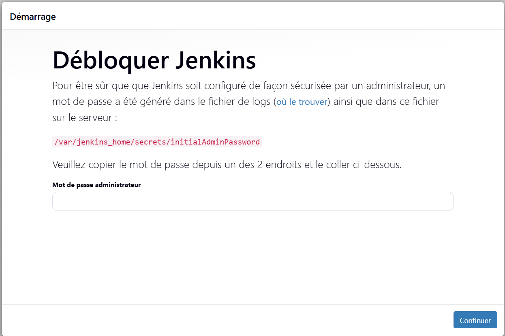
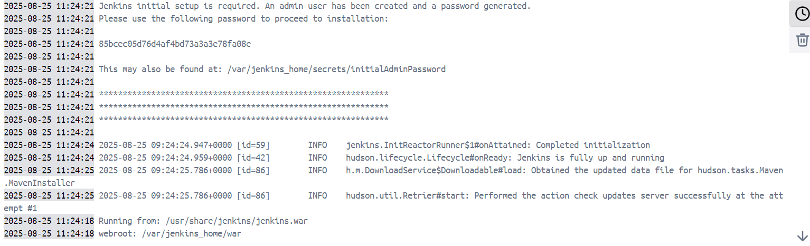
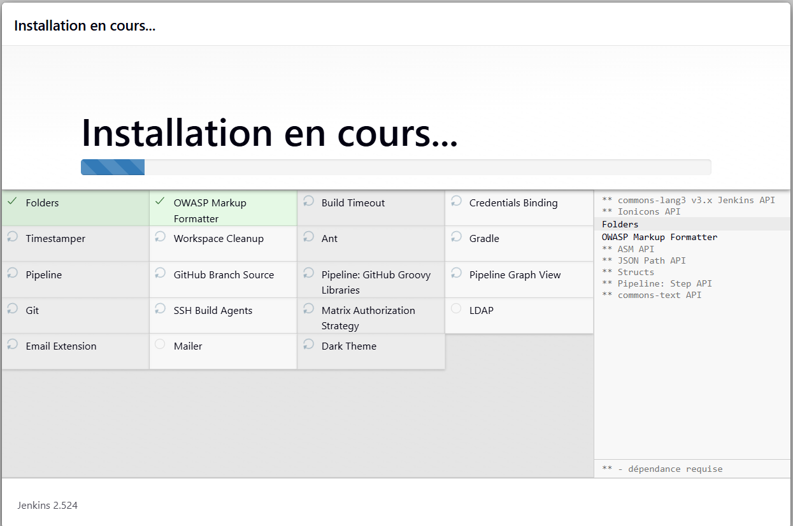

# ci-cd

Procédure d'installation jenkins sur docker

Vérifier que docker est bien installé sur la machine hôte.

Télécharger l'image jenkins LTS

docker pull jenkins/jenkins:lts-jdk17

Création d'un volume persistant

docker volume create jenkins_data

Run le container 

docker run -d -p 8080:8080 -p 50000:50000 -v jenkins_data:/var/jenkins_home --name jenkins jenkins/jenkins:lts-jdk17

Accéder à l'interface web via l'url : http://localhost:8080

Etape 1 : 

Récupération du mot de passe initial : 

Installation des plugins conseillés : 

